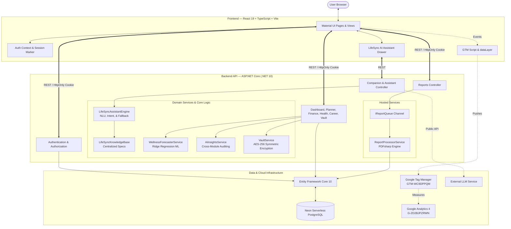

# LifeSync AI

> **An AI-powered personal productivity and life-management platform that brings planning, finance, health, career, secure credentials, and personal insights into one application.**

[](https://lifesync-ai.vercel.app)
[](https://lifesync-ai.onrender.com)
[](https://lifesync-ai.vercel.app)
[](https://lifesync-ai.onrender.com)
[](https://neon.tech)
[](LICENSE)

---

## 📌 1. Overview

**LifeSync AI** is a full-stack life-management ecosystem designed to eliminate context-switching across productivity, financial, and wellness tools. The platform correlates cross-domain user activity to provide continuous habit tracking, actionable coaching, and statistical forecasting:

$$\text{Track Activities} \longrightarrow \text{Detect Patterns} \longrightarrow \text{Synthesize Telemetry} \longrightarrow \text{Optimize Decisions}$$

---

## 🚀 2. Key Features

| Module | Core Functionality | Verified Implementation Details |
|---|---|---|
| **📊 Dashboard** | Central command center with telemetry cards | **Life Score (0–100)**: +5 baseline for any logged activity; +up to 15 for task completion ratio; +up to 30 for hydration (2000ml goal); +up to 15 for workout (30m goal); +up to 10 for sleep (8h goal); +up to 10 for steps (10k goal); +10 for logging calories; +/-5 based on net balance sign. |
| **📅 Planner** | Task scheduling & time-blocking | Event title, description, category, start/end timestamps, completion checkboxes, and agenda calendar views. Completed tasks directly advance the daily Life Score. |
| **💰 Finance** | Real-time ledger & commitment engine | Real-time liquid balance ($\text{Income} - \text{Expenses}$). Automatically normalizes recurring commitments: <br>• $\text{Monthly Committed} = \sum \text{Monthly} + \frac{\sum \text{Yearly}}{12}$<br>• $\text{Yearly Committed} = \sum \text{Yearly} + (\sum \text{Monthly} \times 12)$ |
| **💧 Health & Wellness** | Daily wellness habit tracking | Hydration (+250ml quick-log, 2000ml target), sleep (8h target), daily steps (10,000 goal), workout minutes (30m target), and calories. Includes in-engine **Ridge Regression** ML trend forecasting. |
| **💼 Career Tracker** | Job application pipeline | 4-stage pipeline (`Applied` &rarr; `Interviewing` &rarr; `Offered` &rarr; `Rejected`), company, role title, application date, recruiter prep notes, and dashboard sync. |
| **🔐 Secure Vault** | Digital credential & secret note safe | Web logins (URL, username, password) and private secure notes. Sensitive strings are symmetrically encrypted in PostgreSQL using **AES-256 (CBC/PKCS7)**. Includes password visibility toggles and zero-knowledge exports. |
| **🧠 AI Insights** | Cross-domain habit coaching | Evaluates spending ratios (warns when expenses exceed 80% of income), hydration deficits, sleep debt, and pending task backlog to generate categorized advisory cards. |
| **🤖 AI Assistant** | In-app contextual copilot | Security-first dual-engine assistant with multi-turn pronoun memory, Hinglish parsing, feature guidance, and authenticated user metrics. |
| **📑 PDF Reports** | Asynchronous document exporter | In-memory queue (`IReportQueue`) processed by a background worker using **PDFsharp**. Supports Daily, Weekly, Monthly, and Yearly horizons for master and module scopes. |
| **🛡️ Admin Panel** | Administrative governance & RBAC | Protected via `[Authorize(Roles = "Admin")]`. Searchable user directory, role assignment (`User` / `Admin`), and instant account enable/disable with immediate session termination. |

---

## 🤖 3. LifeSync AI Assistant

The assistant is embedded directly in the application drawer to guide workflows, answer questions, and report metrics without hallucination:

```
User Query
    │
    ▼
[ 🔒 Security Guardrail ] ──(Credential extraction attempt)──► Instant Refusal
    │
    ▼ (Safe Query)
[ Intent & Entity Detection Engine ]
    ├── Normalizes Hinglish ("planner kya hai", "kaise use kare"), slang, & typos
    ├── Multi-turn context: resolves pronouns ("it", "that", "its") from session.LastEntity
    ├── Sub-intent routing (Overview, Purpose, How-To, Benefits, Location, Actions)
    └── Scopes authenticated queries to live user data (balance, tasks, health, jobs)
    │
    ▼
[ Dual-Engine Execution ]
    ├── Primary: Dynamic LLM Generation (System prompt with full app specs & user data)
    └── Fallback: Deterministic Engine (What it is → What you can do → How it helps → How to use it)
```

- **Intent & Entity Detection**: Understands varied ways of asking about features (e.g., *"what is planner"*, *"planner kya hai"*, *"where do I log expense"*, *"how does finance work"*).
- **Hinglish, Slang & Typo Handling**: Robust preprocessing handles informal queries (e.g., *"finance ka use?"*, *"vault safe hai?"*, *"where track job"*).
- **Multi-Turn Pronoun Resolution**: Maintains conversational context across turns using `session.LastEntity`:
  > *User:* "What is Planner?" &rarr; *Assistant:* Explains Planner.  
  > *User:* "How does it help me?" &rarr; *Assistant:* Resolves *"it"* &rarr; explains Planner benefits.  
  > *User:* "Where do I find it?" &rarr; *Assistant:* Resolves *"it"* &rarr; explains Planner navigation.  
  > *User:* "What about Finance?" &rarr; *Assistant:* Switches active context to Finance.  
  > *User:* "How does that work?" &rarr; *Assistant:* Resolves *"that"* &rarr; explains Finance workflow.
- **Feature & Button Guidance**: Provides step-by-step instructions for all buttons (e.g., *'Track Application'*, *'Save Encrypted'*, *'Generate Insights'*).
- **Scoped User Metrics**: Answers questions about current balance, pending tasks, health logs, job applications, and AI recommendations strictly for the authenticated user.
- **Security Guardrail**: Proactively detects and rejects prompt injection and credential dump attempts (passwords, JWT secrets, database connection strings, master encryption keys).
- **Deterministic Fallback Engine**: If the external AI service times out (>20s), is unreachable, or returns an empty response, the system falls back to a deterministic engine structured as:
  $$\text{What it is} \longrightarrow \text{What you can do} \longrightarrow \text{How it helps} \longrightarrow \text{How to use it}$$

---

## 📑 4. PDF Report Architecture

Report exports run asynchronously to guarantee zero HTTP thread blocking:

```
[ Export Report Click ]
         │
         ▼
[ ReportsController ] ──► Enqueues Job ──► [ IReportQueue Channel ]
                                                    │
                                                    ▼
[ Downloadable PDF ] ◄── Uses PDFsharp ◄── [ ReportProcessorService ]
                                            (BackgroundService Worker)
```

- **Background Channel**: Submissions are pushed to `System.Threading.Channels` (`IReportQueue`).
- **Hosted Worker**: `ReportProcessorService` (`BackgroundService`) dequeues jobs, loads database records, and compiles styled vector PDFs using **PDFsharp**.
- **Supported Horizons**: **Daily** (last 24h), **Weekly** (last 7d), **Monthly** (last 30d), and **Yearly** (last 365d).
- **Scopes**:
  - *Dashboard*: Common Master Report synthesizing all modules.
  - *Module Pages*: Focused activity summaries for that specific domain.
- **Zero-Knowledge Vault Export**: Vault reports export item titles, URLs, and timestamps only—passwords and secret keys are **never** exported.
- *Format Specification: LifeSync AI generates reports strictly in PDF format; Excel/CSV export is not supported.*

---

## 🏛️ 5. Application Architecture



---

## 💻 6. Technology Stack

| Domain | Technologies | Version / Spec |
|---|---|---|
| **Frontend** | React, TypeScript, Vite | `React v19.2.7`, `TypeScript v6.0.2`, `Vite v8.1.0` |
| **UI & Styling** | Material UI (MUI), Emotion, Framer Motion | `@mui/material v9.1.2`, `@emotion/react v11.14.0`, `framer-motion v12.42.0` |
| **Data Fetching & State** | TanStack React Query, Axios | `@tanstack/react-query v5.101.2`, `axios v1.18.1` |
| **Backend API** | ASP.NET Core Web API | `.NET 10.0` (`net10.0`) |
| **Database & ORM** | PostgreSQL (Neon), Entity Framework Core | `Npgsql.EntityFrameworkCore.PostgreSQL v10.0.3`, `EF Core v10.0.9` |
| **Authentication** | JWT Bearer, HttpOnly Cookie, BCrypt | `System.IdentityModel.Tokens.Jwt v8.19.1`, `BCrypt.Net-Next v4.2.0` |
| **Cryptography** | AES-256 Symmetric Encryption | `System.Security.Cryptography.Aes` (CBC with PKCS7 padding) |
| **Machine Learning** | Ridge Regression, Microsoft.ML | `Microsoft.ML v5.0.0` + custom regularized Ridge Regression engine |
| **Background Queue** | `System.Threading.Channels`, `BackgroundService` | Asynchronous decoupled producer-consumer queue |
| **Document Generation** | PDFsharp Core | `PDFsharp v6.2.4` |
| **NLU & Assistant** | Custom Semantic Parser + Pollinations AI | Dynamic system prompt injection + deterministic fallback |
| **Analytics & Telemetry** | Google Tag Manager, Google Analytics 4 | Container `GTM-WC9DPPQM`, Measurement ID `G-ZD2BJPZRWN` |

---

## 📈 7. Analytics Pipeline

LifeSync AI uses a non-intrusive event pipeline to measure navigation and user interactions:

$$\text{React UI Action} \xrightarrow{\text{trackAction() / trackPageView()}} \text{window.dataLayer} \xrightarrow{\text{Custom Events}} \text{Google Tag Manager (GTM-WC9DPPQM)} \xrightarrow{\text{Consolidated GA4 Tags}} \text{Google Analytics 4 (G-ZD2BJPZRWN)}$$

- **Navigation Views**: Pushed on route changes (`dashboard_view`, `planner_view`, `finance_view`, `health_view`, `career_view`, `vault_view`, `ai_insights_view`).
- **User Actions**: Pushed on key interactions (`login`, `register`, `transaction_add`, `companion_message_sent`).

---

## 📂 8. Repository Structure

```text
Lifesync ai/
├── backend/
│   ├── LifeSyncAI.API/               # Web API project
│   │   ├── Controllers/              # REST Controllers (Auth, Planner, Finance, Companion...)
│   │   ├── Program.cs                # Dependency injection, middleware pipeline, CORS
│   │   └── appsettings.json          # Configuration placeholders
│   ├── LifeSyncAI.Core/              # Domain & Data Layer
│   │   ├── Database/                 # ApplicationDbContext, model configurations
│   │   ├── Models/                   # Entities (User, PlannerEvent, Transaction, HealthLog...)
│   │   ├── Services/                 # AssistantEngine, KnowledgeBase, VaultService, Forecaster
│   │   └── Responses/                # Standardized ApiResponse<T> envelopes
│   └── LifeSyncAI.sln                # .NET Solution file
├── frontend/
│   ├── src/
│   │   ├── api/                      # Axios client instance (withCredentials: true)
│   │   ├── components/               # Reusable UI (Navbar, Sidebar, CompanionChatDrawer)
│   │   ├── context/                  # AuthContext (session state, auth initialization)
│   │   ├── pages/                    # Dashboard, Planner, Finance, Health, Career, Vault, Admin
│   │   ├── utils/                    # Analytics (GTM dataLayer helpers), date formatters
│   │   ├── App.tsx                   # Route definitions
│   │   └── main.tsx                  # React entry point
│   ├── package.json
│   └── vite.config.ts
└── README.md
```

---

## 🛠️ 9. Local Setup & Configuration

### Prerequisites
- [.NET 10 SDK](https://dotnet.microsoft.com/download)
- [Node.js (v20+)](https://nodejs.org/)
- A local PostgreSQL database or free [Neon Serverless PostgreSQL](https://neon.tech/) instance

### 1. Backend Configuration
Create `backend/LifeSyncAI.API/appsettings.Development.json`:
```json
{
  "ConnectionStrings": {
    "DefaultConnection": "Host=localhost;Database=lifesync;Username=postgres;Password=your_password"
  },
  "JwtSettings": {
    "Secret": "YourSecureKeyWithAtLeast32CharactersRequiredHere!",
    "Issuer": "LifeSyncAI_API",
    "Audience": "LifeSyncAI_Client",
    "AccessTokenExpirationMinutes": 60,
    "RefreshTokenExpirationDays": 7
  }
}
```

Restore, build, and run the backend:
```bash
cd backend
dotnet restore
dotnet build
dotnet run --project LifeSyncAI.API/LifeSyncAI.API.csproj
```
The API will start at `http://localhost:5000` (or `https://localhost:5001`).

### 2. Frontend Configuration
Create `frontend/.env`:
```env
VITE_API_URL=http://localhost:5000
VITE_GTM_ID=GTM-WC9DPPQM
```

Install dependencies and start the Vite dev server:
```bash
cd frontend
npm install
npm run dev
```
Open your browser at `http://localhost:5173`.

---

## 🌐 10. Deployment Architecture

```
[ Frontend: Vercel ]                  [ Backend: Render ]                  [ Database: Neon ]
https://lifesync-ai.vercel.app ──HTTPS──► https://lifesync-ai.onrender.com ──SSL──► PostgreSQL Serverless
```

- **Frontend**: Hosted on [Vercel](https://vercel.com/) with continuous integration from main branch.
- **Backend API**: Hosted on [Render](https://render.com/) running containerized ASP.NET Core Web API with automated HTTPS.
- **Database**: Serverless PostgreSQL provisioned via [Neon](https://neon.tech/) with pooled connections and automated SSL.

---

## 🧪 11. Verification & Testing

The repository includes test suites verifying builds, security rules, and assistant NLU:

```bash
# 1. Build and verify Backend API
dotnet build backend/LifeSyncAI.API/LifeSyncAI.API.csproj

# 2. Build and verify Frontend
npm --prefix frontend run build

# 3. Run exhaustive 311-case LifeSync AI Assistant test suite
dotnet run --project scratch/AssistantTestRunner/AssistantTestRunner.csproj
```

*Verification Results: **311 of 311 tests passing (0 failures)*** across application-level queries, all 8 modules (10 variations each), multi-turn pronoun tracking, security refusal guardrails, Hinglish matching, and user metrics.

---

## 🔗 12. Live Project Links

- **Production Web Application**: [https://lifesync-ai.vercel.app](https://lifesync-ai.vercel.app)
- **Production Web API**: [https://lifesync-ai.onrender.com](https://lifesync-ai.onrender.com)

---

## 👨‍💻 13. Author & Creator

**Darshil Golaniya**
- **Portfolio**: [https://darshil-golaniya.vercel.app/](https://darshil-golaniya.vercel.app/)
- **GitHub**: [@darshilprajapati](https://github.com/darshilprajapati)

---

## 📄 14. License

This project is licensed under the MIT License — see the [LICENSE](LICENSE) file for details.
